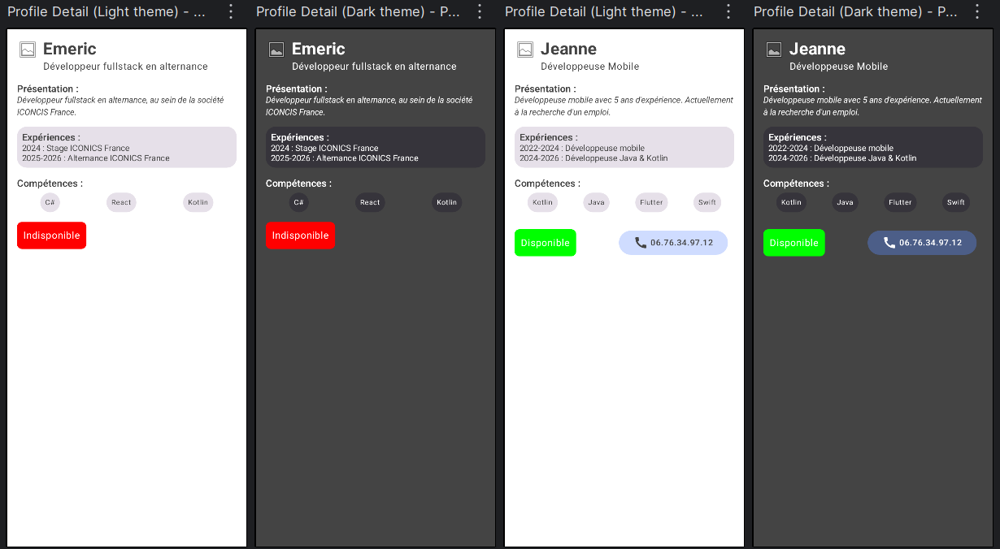

# Profil développeur - Compose

## Contributeur
Emeric SAUTHIER

## Description
L'écran de profil affiche les informations d'un développeur en colonne.
L'affichage comporte un titre (nom + role), trois sections ("Description", "Compétences", "Expériences"),
un badge indiquant la disponibilité (le style varie en focntion de la disponibilité) et
un bouton de contact (visible si le développeur est disponible).

## Composants utilisés
- Text
- Button
- Image
- Card
- Icon
- Scaffold

## Layouts utilisés
- Column
- Row
- LazyColumn
- LazyRow
- Spacer
- Surface

## Utilisation de LazyRow & LazyColumn

- **`LazyRow`** dans (`ProfileSkillsSection`) : affiche horizontalement la liste des compétences, chaque compétence étant rendue par le composable réutilisable `ProfileSkillCard`.
- **`LazyColumn`** dans (`ProfileExperienceCard`) : affiche verticalement la liste des expériences à l'intérieur d'une `Card`, contenant le titre de section et les expériences.

## Thème

Le thème est défini dans `ui/theme/` :

- **Couleurs** : deux palettes personnalisées : une "light" et une "dark". Le mode est choisi avec `isSystemInDarkTheme()`.
- **Typographie** : `ProfileTypography` définit le style des textes des composants.
- **Formes** : `ProfileShapes` définit les formes des composants (bords arrondis).

Cela permet de garder une interface cohérente dans toute l'application.
Le projet contient 4 previews dans `MainActivity.kt`, couvrant le thème clair et 
le thème sombre pour les deux profils d'exemple (disponible et indisponible).

## Captures d'écrans

## Quelles notions du chapitre Compose UI ont été réutilisées ?
- LazyColumn & LazyRow
- Themes (couleur, shapes, typographie)
- Icon
- Image
- Card